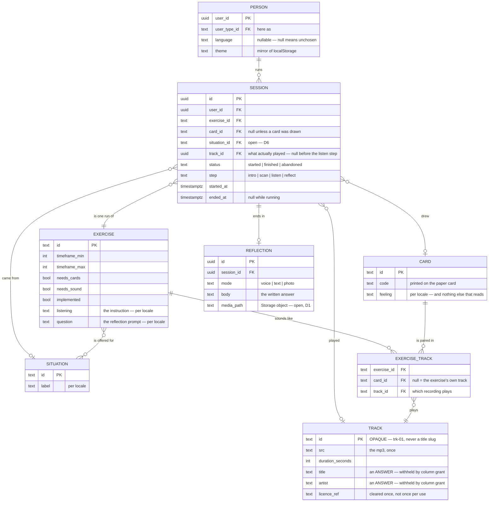
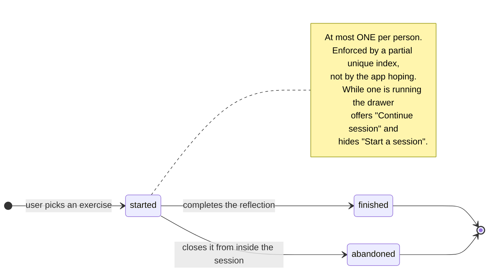

# DOMAIN-MODEL.md

The entities Musie is built from, what each one owns, and which questions are
still open.

Supersedes the diagram of 2026-09-19 in three places, each marked **CHANGED**
with the reason. Everything else is that diagram, written out.

Status of this document: **the Session and Reflection tables do not exist yet.**
Everything under "Already built" is live and verified; everything under "To
build" is a proposal waiting on the open decisions at the foot.

---

## The shape



**Diary is not on this diagram because it is not an entity** — it is every
session for the current user that is no longer `started`, newest first.

### The session's life



Both terminal states are in the Diary; `finished` and `abandoned` are kept
apart so a session someone walked out of is not shown as one they completed.

---

## Already built

### Person — `profiles`

| Column | Notes |
|---|---|
| `user_id` | PK, references `auth.users`, cascade delete |
| `display_name` | |
| `user_type_id` | → `user_types`. "Here as": by myself / with a group / … |
| `language` | **nullable on purpose** — null means no choice recorded, which is what lets `navigator.language` be consulted |
| `theme` | `not null default 'light'`; a mirror of `localStorage`, written but never read |
| `created_at` | |

Created by a trigger on `auth.users` insert, never by the client.

### Exercise — `exercises` + `exercise_i18n` + `exercise_situations`

The library. Three rows; one implemented.

Owns `timeframe_min/max`, `needs_cards`, `needs_sound`, `implemented`, `sort`,
and per locale `name`, `description`, `needs`, `guideline`, `duration_label`,
`image_alt` — **and, since the re-cut, `listening` and `question`.**

**CHANGED ⑤: the listening instruction and the reflection question follow the
EXERCISE.** Not the card, not the track. One of each per exercise, used with
every card that exercise draws.

> **Both are null for all three exercises.** The source has no exercise-level
> instruction or question — it wrote nine per-card variants instead — so six
> strings (3 exercises × 2 locales, twice over) have to come from the
> Mindfulness Cards spreadsheet. Until they do, no exercise can say what to do
> while the track plays.

### Card — `cards` + `card_i18n`

Nine rows, one deck, **shared across exercises** — card 3 is the same card
whichever exercise drew it.

A card carries its **feeling** and nothing else that reads. The instruction and
the question moved to the exercise; the track moved to the pair. What card 3
sounds like, and what you are asked about it, are not the card's to say.

> **Eighteen strings were dropped in the re-cut.** The nine per-card listening
> instructions and nine questions — *"Listen loudly if you can. Let the volume
> carry it instead of holding it."*, *"What is the anger protecting?"* — had no
> home once both follow the exercise. They were placeholder copy by the source
> file's own admission, but they were the most characterful thing in the seed.

### Track — `tracks`, and the pairing — `exercise_tracks`

**CHANGED ⑦: a recording is stored once, and pointed at.** `tracks` holds the
music; `exercise_tracks` says when it plays.

```sql
tracks          id text PK, src unique, duration_seconds, title, artist, licence_ref
exercise_tracks exercise_id, card_id (nullable), track_id
                unique nulls not distinct (exercise_id, card_id)
```

An earlier shape keyed the recording itself to the `(exercise, card)` pair.
That duplicated `src`, `title`, `artist`, `duration` **and `licence_ref`** for
every place a recording was used, so two copies of one credit could silently
disagree — and *"how many tracks are cleared for commercial use"* became
`count(distinct src)` rather than `count(*)`. You license a recording, not a
pairing. Proved:

```
 id     | title       | artist      | played_in
 trk-01 | Morgenlicht | Ida Sperber |         2     ← one row, two exercises
```

**CHANGED ④ still holds**, and now lives on the pairing: the same card plays a
different file in a different exercise, `card_id` is nullable so a cardless
exercise can have its own track, and `unique nulls not distinct` stops one
exercise collecting several.

**`track_id` is `on delete restrict`.** Deleting a recording something still
plays fails loudly rather than quietly unhooking it:

```
ERROR:  update or delete on table "tracks" violates foreign key constraint
DETAIL:  Key (id)=(trk-01) is still referenced from table "exercise_tracks".
```

**The track ids are deliberately opaque** — `trk-01`, not `morgenlicht`. Every
other id in this schema is a readable slug, and here that would be a leak:
`exercise_tracks.track_id` **is** granted to the client, so a title-derived id
would hand over the answer the column grant exists to withhold. The premise of
the exercise is a listener who is not primed by the track name.

`title` and `artist` stay withheld by column grant on `tracks`;
`exercise_tracks` needs no column grant at all, because it holds only ids and
`tracks.id` says nothing.

> **Two exercises are still silent.** Breathing Score and Body Scan Soundwalk
> each want a pairing row with a null `card_id`, and the source has no file for
> either.

### Situation — `situations` + `exercise_situations`

Three situations, seven pairs. How the prototype narrows which exercise to
offer.

---

## To build

### Session

One run of one exercise by one person.

| Column | Type | Notes |
|---|---|---|
| `id` | uuid | |
| `user_id` | uuid | → `profiles`, cascade delete |
| `exercise_id` | text | → `exercises` |
| `card_id` | text, **nullable** | → `cards`. Null for exercises that draw no card |
| `situation_id` | text, **nullable** | → `situations`. Which situation led here — **open, see D6** |
| `track_id` | uuid, **nullable** | → `tracks`. What actually played; null until the listen step |
| `status` | text | `started` · `finished` · `abandoned` |
| `step` | text | `intro` · `scan` · `listen` · `reflect` — where to resume |
| `started_at` | timestamptz | not null |
| `ended_at` | timestamptz, nullable | set when status leaves `started` |

**CHANGED ①: three statuses, not two.** The diagram had `Angefangen` /
`Beendet`. You confirmed a user must *close* a running session **or** *finish*
it before starting another — two different terminating actions. Collapsing both
into `Beendet` would make a session someone walked out of indistinguishable
from one they completed, and the Diary exists precisely to show that
difference.

Values are English identifiers (`started` / `finished` / `abandoned`) with
German as display copy through the i18n catalogue — the same split the rest of
the schema uses, where ids are English slugs and `locale` is `de` / `en`.

**CHANGED ⑥: the session records the track it played — in every exercise, not
only the ones where a track is "linked directly to a session".**

For a card-drawing exercise the track looks derivable: the session already
holds `exercise_id` and `card_id`, and `tracks` is keyed on exactly that pair.
Derivable is not the same as recorded, and for a diary the difference matters:

- **Content edits would rewrite history.** Swap the file behind
  (mindfulness-cards, mc-03) and every past diary entry silently starts
  claiming you heard something you never heard. A journal that changes what it
  says you did is broken, and no constraint would catch it.
- **Resuming must not re-roll.** Where the track is chosen rather than looked
  up, the choice has to survive a closed tab.

So `track_id` is a fact the session owns, not a lookup it performs.
`exercise_id`, `card_id` and `track_id` are three different facts — what you
were doing, what you drew, what played — and only the third answers "what did I
listen to".

**CHANGED ②: two timestamps, not one.** `started_at` + `ended_at`, so the Diary
can show how long a session took. One field cannot express a duration.

**At most one running session per person**, enforced by the database rather
than hoped for by the app:

```sql
create unique index sessions_one_running_per_user
  on public.sessions (user_id)
  where status = 'started';
```

That rule has two visible consequences:

- the nav drawer hides "Start a session" while one is running and offers
  "Continue session" instead — already built, waiting only on this table;
- **closing must be reachable from inside the session screen.** Once a session
  is running the drawer offers no other way out, so without a close control
  there the only exit is to finish.

### Reflection

What the person recorded at the end.

| Column | Type | Notes |
|---|---|---|
| `id` | uuid | |
| `session_id` | uuid | → `sessions`, cascade delete |
| `mode` | text | `voice` · `text` · `photo` |
| `body` | text, nullable | the written answer |
| `media_path` | text, nullable | Storage object for voice / photo |
| `created_at` | timestamptz | |

Exactly one of `body` / `media_path` is set, which a check constraint can
enforce.

### Diary

**Not a table.** Every session for the current user that is no longer
`started`, newest first, joined to its exercise and card for display. A query,
or a view if it earns one.

---

## Where the diagram's boxes actually live

The diagram listed seven things under Exercise. They are three different kinds
of thing, and separating them is most of what this revision does.

| Diagram box | Kind | Lives in |
|---|---|---|
| Start | **step** | `intro` — a route segment, not data |
| Auswahl Hilfe / Selection Help | content | `exercise_i18n.guideline` — *"Work with the card you are drawn to, not the one you think you should pick"* |
| Listening Instructions | content | `exercise_i18n.listening` — **moved**, and null until the spreadsheet lands |
| Listening Question | content | **nothing yet — see D4** |
| Track | content | `tracks` (the recording, once) + `exercise_tracks` (when it plays) |
| Listening Instructions *(again)* | ? | **see D3** |
| Reflection Question | content | `exercise_i18n.question` — **moved**, same |
| Übungsbibliothek | the `exercises` table itself | |
| Voice Memo / Text / Bild | record | `reflections.mode` |
| Status + Timestamp | record | `sessions.status`, `started_at`, `ended_at` |

**CHANGED ③: Card is an entity, and it owns the listening instructions, the
reflection question and the track.** The diagram attached those to Exercise and
showed no Card at all. In Quick Mindfulness Break the nine cards each carry
their own feeling, instruction, question and track — that is the whole deck.
Attaching them to Exercise would leave one of each per exercise and the deck
would stop meaning anything. So the Session records *which card was drawn*
(`session.card_id`) and the content is read from the card.

---

## Open decisions

These block the migration, in roughly descending order of cost.

### D1 · Storing reflections contradicts a promise the prototype makes

The prototype says, on the written answer, the voice note **and** the photo:

> "Nothing leaves your device until you share it."

A Diary of past sessions means voice memos, photos and text are stored
server-side. Both cannot be true. If the Diary wins, that copy changes before
anything ships — and voice and photo mean **Supabase Storage**: a bucket,
object-level RLS, and a retention policy. That is a larger piece of work than
the sessions table itself, and it is a promise to users rather than a technical
detail.

### D10 · Does every exercise share the one deck?

Assumed yes, and now **built on that assumption**: card 3 exists in both
exercises, so `cards` is a flat shared deck and only the pairing varies. An
exercise with its own deck would need a third table, not a column — and
re-seeding.

### D11 · How does a track get chosen when it is not looked up?

"In some exercises a track is linked directly to a session" says *where the
link lives*, not *how the track is picked*. `sessions.track_id` covers the link
either way. What it does not say is how those exercises choose:

- the user picks from a list;
- the exercise rotates, or picks at random, and the session pins the result;
- something else entirely.

It matters because "pick at random" needs a rule for repeats — the same track
twice running is a bad session — and that rule needs to see history, which
means the diary is an input to the picker rather than only an output of it.

### D12 · The schema is a moving target, and the current method has a shelf life

Noted: more fields are coming to every table. Two consequences worth stating
before they bite.

**Migrations are being rewritten in place, not stacked.** Every content change
so far — the exercise rename, the track re-key, the content re-cut — edited
`20260918150500_content_schema.sql` as though it had always said that, and
`supabase db reset` rebuilt from scratch. That is only safe because **nothing
is deployed and no hosted project is linked**. The day either becomes untrue,
every added field is its own `alter table` migration and the history stops
being editable. Worth deciding deliberately rather than discovering.

**A table nobody has built yet costs nothing to change.** `sessions` and
`reflections` are still only in this document, so fields arriving now are free.
The same fields arriving after the tables ship are migrations against live
rows. If more shape is coming, there is an argument for letting it arrive
before building them — and none for building them twice.

### D2 · One reflection per session, or one per mode?

The prototype's segmented control picks exactly one of voice / text / photo.
Can someone record audio *and* write? One row with a unique `session_id`, or
many rows per session. The table above assumes one; the constraint is a
one-line difference.

### D3 · "Listening Instructions" appears twice in the diagram — now cheap

Once between Selection Help and Listening Question, once between Track and
Reflection Question. A duplicated box, or two genuine blocks — one read before
the track and one after?

**The re-cut made this cheap.** It used to mean a second column on
`card_i18n` and eighteen more strings; now it is a second column on
`exercise_i18n` and six.

### D4 · "Listening Question" and "Reflection Question" are both listed — now cheap

The schema has one `question` per exercise. If the listening step asks its own
question as well, that is a second column on `exercise_i18n` and three more
strings per locale — not eighteen, as it would have been per card.

### D5 · Do the four steps survive?

The router validates `intro · scan · listen · reflect` today and redirects an
unknown step. The diagram's sequence is finer-grained. Are those the same four
renamed, a replacement, or not steps at all? `sessions.step` and the route's
loader both follow from the answer.

### D6 · Does a session record its situation?

`situations` and `exercise_situations` exist and are how the prototype narrows
the offer, but the diagram omits them. Worth keeping on the session — "what was
I trying to do?" is diary-grade context — but it is a product call.

### D7 · What does the Diary show for an abandoned session?

The status now distinguishes it. Whether the Diary lists abandoned sessions
alongside finished ones, separates them, or hides them is a design decision,
not a data one.


---

## Resolved

### D8 · Where a cardless exercise's track lives — ONE TABLE, NULLABLE CARD

`tracks.card_id` is nullable and null means "the exercise's own track", with
`unique nulls not distinct (exercise_id, card_id)` keeping one per pair. The
two-table alternative was rejected: it would have cost two query paths and two
sets of column grants for the same protection.

### D9 · Whether the instruction and question follow the track — NO, THE EXERCISE

They are `exercise_i18n.listening` and `.question`, one of each per exercise,
used with every card it draws. `card_i18n` keeps only the feeling. This was the
decision that turned a re-key into a re-cut of the content model, and it is the
reason eighteen per-card strings were dropped and six exercise-level ones are
now owed.

---

## What the content still owes

| Missing | Count | Why it is missing |
|---|---|---|
| `exercise_i18n.listening` | 3 exercises × 2 locales | the source only ever wrote per-card variants |
| `exercise_i18n.question` | 3 exercises × 2 locales | same |
| A track for Breathing Score | 1 file | needs sound, draws no card, no file in the source |
| A track for Body Scan Soundwalk | 1 file | same |

None of this blocks the schema — the columns and the rows exist and are
nullable. It blocks the screens: an exercise that cannot say what to do while
the track plays has nothing to show at the listen step.
