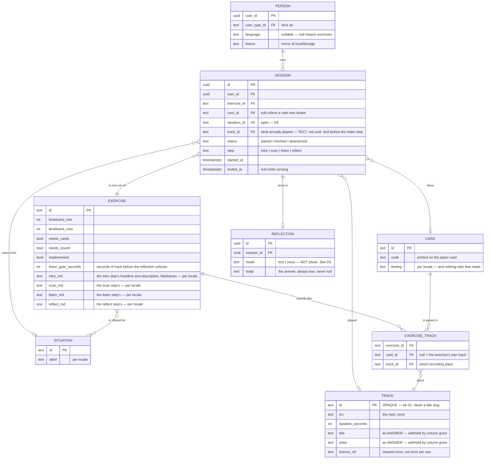
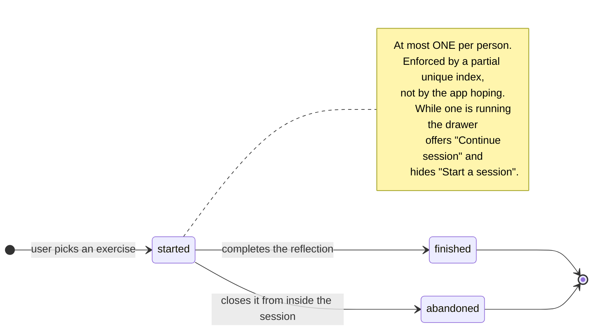

# DOMAIN-MODEL.md

The entities Musie is built from, what each one owns, and which questions are
still open.

Supersedes the diagram of 2026-09-19 in three places, each marked **CHANGED**
with the reason. Everything else is that diagram, written out.

Status of this document, **revised 19 September after Phase C.0 and C.3**:
the Session and Reflection tables now EXIST. Everything below is live and
verified against `supabase db reset` + `pnpm test:db` (57 tests) unless a line
says otherwise.

Phase C answered nine of the twelve open decisions. They have moved to
**Resolved** at the foot, each with the shape it actually took — which in four
places is NOT the shape this document originally proposed. Those four are
marked **CORRECTED** and are the reason to re-read rather than skim:
`sessions.track_id` is `text`, the `on delete` behaviours are not cascade,
`reflections` has no `media_path`, and the exercise's step copy is four arrays
rather than two strings.

---

## The shape



**Diary is not on this diagram because it is not an entity** — it is every
session for the current user that is no longer `started`, newest first.

### The session's life



Both terminal states are in the Diary; `finished` and `abandoned` are kept
apart so a session someone walked out of is not shown as one they completed.

**CORRECTED 2026-09-20 — `finished` means REACHED THE END, not "left words".**
The transition above reads *completes the reflection*, and D.5c found that it
cannot: `reflections.body` is `not null`, so declining to answer can only be
expressed as the ABSENCE of a reflection row. Ben's answer is that a declined
reflection still finishes the session — you did the exercise, and whether you
wrote anything down is a separate fact the diary already reports on its own.
So the label on that arrow describes the common case rather than the rule, and
`sessionMachine.FINISH` enforces the rule it always did: you must be on the
last step.

---

## Already built

### Person — `profiles`

| Column | Notes |
|---|---|
| `user_id` | PK, references `auth.users`, cascade delete |
| `display_name` | |
| `user_type_id` | → `user_types`. "Here as": by myself / with a group / … |
| `language` | **nullable on purpose** — null means no choice recorded, which is what lets `navigator.language` be consulted |
| `theme` | `not null default 'light'`; a mirror of `localStorage`, written but never read |
| `created_at` | |

Created by a trigger on `auth.users` insert, never by the client.

### Exercise — `exercises` + `exercise_i18n` + `exercise_situations`

The library. Three rows; one implemented.

Owns `timeframe_min/max`, `needs_cards`, `needs_sound`, `implemented`, `sort`,
`listen_gate_seconds`, and per locale `name`, `description`, `needs`,
`image_alt` — plus the step copy below.

**DROPPED 2026-09-21: `duration_label`.** Two fields said how long an exercise
takes and they disagreed — `timeframe_min/max` said **2–12 minutes**,
`duration_label` said **"About 15 minutes"**, and both were on the same screen.
The range wins: it is structured, a number needs no translation, and it cannot
drift from itself. Where the detail lightbox had a *Duration* row it now reads
the timeframe through the key the card's fact chip already used, so the fact
survives and has one source. Migration `20260921120000`, found on the first
hosted walk-through.

**ADDED 2026-09-20: `listen_gate_seconds`.** How much of the track has to be
behind you before the reflection unlocks. It was a hardcoded 90 in the listen
step, carried over from the prototype, and Ben settled that it VARIES by
exercise — a two-minute card draw and a twenty-minute soundwalk do not earn the
same wait.

In `exercises` rather than `exercise_i18n` because it is a number, not copy,
which is the same reasoning that puts `timeframe_min` there. `not null default
90`; the app caps it at the track's own duration, so a gate longer than the
recording is satisfied by finishing it rather than being unreachable.

Only Quick Mindfulness Break's 90 is MEASURED — it is the prototype's figure,
arrived at against the real card tracks. The other two are estimates
proportional to their own timeframes (60s and 180s) and are flagged as such in
the seed, because neither exercise has a recording to tune against yet.

**CHANGED ⑤: the step copy follows the EXERCISE.** Not the card, not the
track. Used with every card that exercise draws.

**RE-CUT AGAIN on 2026-09-23 — it is FOUR MARKDOWN COLUMNS, and there is no
`question`.** C.0 had made it four `text[]` plus one `question`; Ben's answer
is that every step needs *a headline and a description text*, and neither half
of that fits an array of equal paragraphs:

| Column | Type | |
|---|---|---|
| `intro_md` | `text` | the intro step's headline and description, as Markdown |
| `scan_md` | `text` | the scan step's — **was `scan_text`, and `guideline` before that** |
| `listen_md` | `text` | the listen step's — **was `listen_text`, and `listening` before that** |
| `reflect_md` | `text` | the reflect step's |

Three things follow from the shape:

- **The headline is an `<h2>`.** Content writes `##`; the parser clamps every
  heading to 2–6 so a content edit can never put a second `<h1>` under the
  exercise name that `ContentBox` already renders as one.
- **A list is a list.** The copy is numbered on intro and scan and bulleted on
  reflect, and it renders as `<ol>` / `<ul>`, so the count and the position
  reach assistive tech instead of being baked into the prose (L3). This is the
  half that `text[]` could not express at all.
- **The subset is bounded, and the bound is a file.**
  `apps/web/src/lib/markdown.ts` is normative: ATX headings, paragraphs,
  ordered and unordered lists, `**strong**` and `*emphasis*`. No HTML, no
  images, no links. Anything else renders as its own literal text — a line is
  never dropped.

**`question` is gone.** One column rendered as the heading of BOTH the listen
and the reflect step, on the rule that the question you hold while the track
plays and the question you answer afterwards must not drift apart. The new
copy makes them different questions on purpose — listen asks what picture
forms, reflect asks what the scene was called and what happened in it — so
each step's headline is its own. The column was null in all six rows, so
nothing written was lost.

> **The copy has landed for Quick Mindfulness Break, and is still owed for the
> other two.** All four columns are filled in both locales for
> `mindfulness-cards` (`20260923120000_exercise_step_markdown.sql`); Breathing
> Score and Body Scan Soundwalk carry none, in either locale, and are
> unimplemented. It is provisional either way — the Mindfulness Cards
> spreadsheet will overwrite it. `select * from public.missing_translations`
> stays quiet about the two empty exercises, because it compares locales
> against each other rather than testing for null — absent from both is data,
> absent from one is a dropped translation.

### Card — `cards` + `card_i18n`

Nine rows, one deck, **shared across exercises** — card 3 is the same card
whichever exercise drew it.

A card carries its **feeling** and nothing else that reads. The instruction and
the question moved to the exercise's own step copy; the track moved to the pair. What card 3
sounds like, and what you are asked about it, are not the card's to say.

> **Eighteen strings were dropped in the re-cut.** The nine per-card listening
> instructions and nine questions — *"Listen loudly if you can. Let the volume
> carry it instead of holding it."*, *"What is the anger protecting?"* — had no
> home once both follow the exercise. They were placeholder copy by the source
> file's own admission, but they were the most characterful thing in the seed.

### Track — `tracks`, and the pairing — `exercise_tracks`

**CHANGED ⑦: a recording is stored once, and pointed at.** `tracks` holds the
music; `exercise_tracks` says when it plays.

```sql
tracks          id text PK, src unique, duration_seconds, title, artist, licence_ref
exercise_tracks exercise_id, card_id (nullable), track_id
                unique nulls not distinct (exercise_id, card_id)
```

An earlier shape keyed the recording itself to the `(exercise, card)` pair.
That duplicated `src`, `title`, `artist`, `duration` **and `licence_ref`** for
every place a recording was used, so two copies of one credit could silently
disagree — and *"how many tracks are cleared for commercial use"* became
`count(distinct src)` rather than `count(*)`. You license a recording, not a
pairing. Proved:

```
 id     | title       | artist      | played_in
 trk-01 | Morgenlicht | Ida Sperber |         2     ← one row, two exercises
```

**CHANGED ④ still holds**, and now lives on the pairing: the same card plays a
different file in a different exercise, `card_id` is nullable so a cardless
exercise can have its own track, and `unique nulls not distinct` stops one
exercise collecting several.

**`track_id` is `on delete restrict`.** Deleting a recording something still
plays fails loudly rather than quietly unhooking it:

```
ERROR:  update or delete on table "tracks" violates foreign key constraint
DETAIL:  Key (id)=(trk-01) is still referenced from table "exercise_tracks".
```

**The track ids are deliberately opaque** — `trk-01`, not `morgenlicht`. Every
other id in this schema is a readable slug, and here that would be a leak:
`exercise_tracks.track_id` **is** granted to the client, so a title-derived id
would hand over the answer the column grant exists to withhold. The premise of
the exercise is a listener who is not primed by the track name.

`title` and `artist` stay withheld by column grant on `tracks`;
`exercise_tracks` needs no column grant at all, because it holds only ids and
`tracks.id` says nothing.

> **Two exercises are still silent.** Breathing Score and Body Scan Soundwalk
> each want a pairing row with a null `card_id`, and the source has no file for
> either.

### Situation — `situations` + `exercise_situations`

Three situations, seven pairs. How the prototype narrows which exercise to
offer.

---

## Built in C.3

`supabase/migrations/20260919120000_sessions.sql`, proved by 26 tests in
`apps/web/src/lib/db.sessions.db.test.ts`.

### Session

One run of one exercise by one person.

| Column | Type | Notes |
|---|---|---|
| `id` | uuid | |
| `user_id` | uuid | → `profiles`, **on delete cascade** |
| `exercise_id` | text | → `exercises`, **on delete restrict** |
| `card_id` | text, **nullable** | → `cards`, **on delete set null** |
| `situation_id` | text, **nullable** | → `situations`, **on delete set null**. Recorded, never yet filled — D6 |
| `track_id` | **text**, nullable | → `tracks`, **on delete restrict**. What actually played |
| `status` | text | `started` · `finished` · `abandoned`, by check constraint |
| `step` | text | `intro` · `scan` · `listen` · `reflect`, by check constraint |
| `started_at` | timestamptz | not null |
| `ended_at` | timestamptz, nullable | set when status leaves `started` |

**CORRECTED ⓐ: `track_id` is `text`, not `uuid`.** This document said `uuid`,
which was right while a track id was `gen_random_uuid()`. Since the tracks
split, `tracks.id` is the opaque slug `trk-01` and only `exercise_tracks.id` is
a uuid. Written as `uuid` the migration does not apply at all.

**CORRECTED ⓑ: the `on delete` behaviours are not cascade, and this document
said they were.** A diary must never silently lose or rewrite what it says you
did, which points three different ways:

- `exercise_id` and `track_id` **restrict** — retiring an exercise or a
  recording somebody has already done fails loudly rather than deleting their
  history or quietly unhooking it.
- `card_id` and `situation_id` **set null** — retiring one of those loses the
  detail, not the entry.
- `user_id` **cascade** — a session dies with its person, and only that way.

**And one invariant the database now holds that no document proposed:**

```sql
check ((status = 'started') = (ended_at is null))
```

A running session cannot carry an end time and an ended one cannot lack it.
Without it, `ended_at` is a field the app has to remember to set, and the Diary
silently shows a duration of nothing.

**CHANGED ①: three statuses, not two.** The diagram had `Angefangen` /
`Beendet`. You confirmed a user must *close* a running session **or** *finish*
it before starting another — two different terminating actions. Collapsing both
into `Beendet` would make a session someone walked out of indistinguishable
from one they completed, and the Diary exists precisely to show that
difference.

Values are English identifiers (`started` / `finished` / `abandoned`) with
German as display copy through the i18n catalogue — the same split the rest of
the schema uses, where ids are English slugs and `locale` is `de` / `en`.

**CHANGED ⑥: the session records the track it played — in every exercise, not
only the ones where a track is "linked directly to a session".**

For a card-drawing exercise the track looks derivable: the session already
holds `exercise_id` and `card_id`, and `tracks` is keyed on exactly that pair.
Derivable is not the same as recorded, and for a diary the difference matters:

- **Content edits would rewrite history.** Swap the file behind
  (mindfulness-cards, mc-03) and every past diary entry silently starts
  claiming you heard something you never heard. A journal that changes what it
  says you did is broken, and no constraint would catch it.
- **Resuming must not re-roll.** Where the track is chosen rather than looked
  up, the choice has to survive a closed tab.

So `track_id` is a fact the session owns, not a lookup it performs.
`exercise_id`, `card_id` and `track_id` are three different facts — what you
were doing, what you drew, what played — and only the third answers "what did I
listen to".

**CHANGED ②: two timestamps, not one.** `started_at` + `ended_at`, so the Diary
can show how long a session took. One field cannot express a duration.

**At most one running session per person**, enforced by the database rather
than hoped for by the app — and now verified: a second insert fails with
`23505` in the suite, watched going red with the index dropped.

```sql
create unique index sessions_one_running_per_user
  on public.sessions (user_id)
  where status = 'started';
```

That rule has two visible consequences:

- the nav drawer hides "Start a session" while one is running and offers
  "Continue session" instead — already built, waiting only on this table;
- **closing must be reachable from inside the session screen.** Once a session
  is running the drawer offers no other way out, so without a close control
  there the only exit is to finish.

### Reflection

What the person wrote at the end.

| Column | Type | Notes |
|---|---|---|
| `id` | uuid | |
| `session_id` | uuid | → `sessions`, **on delete cascade** |
| `mode` | text | `text` · `voice`, by check constraint |
| `body` | text, **not null** | the answer — always text |
| `created_at` | timestamptz | |

**CORRECTED ⓒ: there is no `media_path`, no Storage bucket, and `mode` has two
values rather than three.** D1 is answered: **only text is ever stored.**

- A **voice** answer is transcribed to text and the transcript is stored. So
  it is an ordinary row with `mode = 'voice'` and the words in `body`. **Musie
  never holds a recording of anyone's voice** — the missing column is the
  design, not an omission, and it is the same position the prototype's own
  privacy copy took.
- A **photo** answer is never stored server-side at all, which is why `photo`
  is not a mode. A row would have nothing to put in `body`.

So this document's "exactly one of `body` / `media_path`" collapses to `body
not null`, and the larger piece of work it implied — a bucket, object-level
RLS, a retention policy — does not exist and is not scheduled.

**Two unique constraints, and they are two different rules:**

```sql
unique (session_id, mode)   -- the permanent shape
unique (session_id)         -- "one reflection per session", today's rule
```

The designer chose one per session now, architected to scale to one per mode
later. That scaling is a one-line `drop constraint` on the second index; the
first already says what the final shape is. Nothing else moves.

### Diary

**Not a table.** Every session for the current user that is no longer
`started`, newest first, joined to its exercise and card for display. A query,
or a view if it earns one.

### `completed` is not a column, and D.4 decided it would not become one

`sessions` stores `step`. The wizard's own reachability rule is "every earlier
step is completed", so a row's `step` already implies which steps are behind
it — and `completedBefore(step, skipped)` in `apps/web/src/lib/session.ts` is
that implication, written once.

A column would have been a second source of truth for something the first one
already says, which is the argument `skipped` won in D14 and the same one
again. It has one visible consequence, and it is a behaviour rather than an
accident: **go back a step, close the tab, and you resume at the step you went
back to** rather than the furthest you reached. That is what `sessions.step`
means — where you stopped — and it is what the diary reports for an unfinished
run, so storing "furthest" would have needed a second column meaning something
else.

---

## Where the diagram's boxes actually live

The diagram listed seven things under Exercise. They are three different kinds
of thing, and separating them is most of what this revision does.

| Diagram box | Kind | Lives in |
|---|---|---|
| Start | **step** | `intro` — a route segment, not data |
| Auswahl Hilfe / Selection Help | content | `exercise_i18n.guideline` — *"Work with the card you are drawn to, not the one you think you should pick"* |
| Listening Instructions | content | `exercise_i18n.listening` — **moved**, and null until the spreadsheet lands |
| Listening Question | content | **nothing yet — see D4** |
| Track | content | `tracks` (the recording, once) + `exercise_tracks` (when it plays) |
| Listening Instructions *(again)* | ? | **see D3** |
| Reflection Question | content | `exercise_i18n.question` — **moved**, same |
| Übungsbibliothek | the `exercises` table itself | |
| Voice Memo / Text / Bild | record | `reflections.mode` |
| Status + Timestamp | record | `sessions.status`, `started_at`, `ended_at` |

**CHANGED ③: Card is an entity, and it owns the listening instructions, the
reflection question and the track.** The diagram attached those to Exercise and
showed no Card at all. In Quick Mindfulness Break the nine cards each carry
their own feeling, instruction, question and track — that is the whole deck.
Attaching them to Exercise would leave one of each per exercise and the deck
would stop meaning anything. So the Session records *which card was drawn*
(`session.card_id`) and the content is read from the card.

---

## Still open

Two, and neither blocks anything that is built. D13 and D14 were answered on
19 September and have moved to Resolved.

### D11 · How does a track get chosen when it is not looked up? — DEFERRED to Phase E

`sessions.track_id` covers the link whichever way the answer goes, so nothing
waits on this. What it decides is how the exercises that do NOT draw a card
pick their recording: the user chooses, the exercise rotates, or it picks at
random and the session pins the result.

**Deferred deliberately rather than left unnoticed.** The only implemented
exercise draws cards, so its track is looked up and the question cannot fire
yet. It needs settling before one picks at random, because "at random" needs a
rule for repeats — the same track twice running is a bad session — and that
rule has to read history, which makes the diary an *input* to the picker
rather than only an output of it.

### D15 · Can the Diary NAME the track you heard? — NEW

`sessions.track_id` records what played, so the Diary can offer the recording
back. It cannot say what it was: **`tracks.title` and `tracks.artist` are not
granted to the client at all**, by column grant, and selecting either fails the
request outright rather than returning null.

That grant exists because the premise of the exercise is a listener who has not
been primed by the track name. But **the reveal has already happened by the
time a session is in the Diary** — you heard it, and E.5's reveal gate showed
you what it was. So withholding it from your own diary entry may be the grant
outliving its reason.

Three readings, and it is a product call:

- **The Diary names it**, through the same `reveal-track` Edge Function E.5
  builds. The grant stays; the function is the one door.
- **The Diary offers playback and no name** — which is what is built today,
  because it is what the grant allows without new machinery.
- **The Diary names it only for a FINISHED session**, on the grounds that
  abandoning a session means you never reached the reveal.

Until this is answered the entry page shows a *Listen again* control with no
title. Nothing is blocked: there are no audio files yet (E.4), so `track_id` is
null on every row and the control does not render.

---

## Resolved

### D13 · What is a photo answer FOR, if it is never kept? — IT BECOMES TEXT

The image is read back as text and **only the text is stored**, exactly as a
voice answer is transcribed. So photo and voice turn out to be one feature with
two front doors: both produce words, neither produces a file.

**This changed the schema**, and cheaply, because nothing is deployed:
`reflections.mode` now allows `'photo'` as a third value. `mode` records HOW
THE TEXT WAS PRODUCED — typed, transcribed, or read off a photograph — rather
than what kind of file is attached, because no file is ever attached. The
constraint now says what the product is rather than what this week's build
reaches, which is the whole argument for widening it before A.6 rather than
after.

### D14 · Do the four steps survive an exercise that draws no card? — FOUR, WITH SCAN SKIPPED

The rail shows four markers and `scan` is visibly skipped, so every exercise
reads structurally alike. A three-step rail was the alternative and was not
chosen.

**This was a live bug, not a hypothetical.** The reachability rule wants every
earlier step completed, `scan` never completes for a cardless exercise, so
`listen` was permanently unreachable and the run could not be finished. It
could not fire only because the one implemented exercise draws cards.
`sessionMachine` now carries a `skipped` list — DERIVED from the exercise's
`needs_cards`, never stored, so `sessions` gains no column and a content edit
cannot leave a stale answer behind. Six regression tests cover it.

One consequence for the design system, recorded in its own log: **the wizard
has no *skipped* state.** `InteractiveWizard` offers disabled / active /
selected / completed, and a skipped step is none of those — `completed` would
draw a check mark for something you did not do, and `disabled` reads as "not
yet" rather than "not part of this run". D.4 needs a fifth state or a
deliberate reuse of `disabled`.

### D1 · Whether reflections are stored, and whether voice is among them — TEXT ONLY

Only text is ever stored. A voice answer is transcribed and the transcript is
the row; a photo answer is never stored at all. No `media_path`, no Storage
bucket, no retention policy. Voice and photo are built as interactive UI
mockups in the flow — see [MOCKUPS.md](MOCKUPS.md), which exists because of
this decision.

This also settles the contradiction BUILD-PLAN.md flagged between the
prototype's *"the app never holds a recording of anyone's voice"* and this
document's old `mode: voice` + `media_path`. The prototype was right.

### D2 · One reflection per session, or one per mode? — ONE PER SESSION, SHAPED TO SCALE

`unique (session_id)` today, with `unique (session_id, mode)` alongside it as
the permanent shape. Scaling to one-per-mode is dropping the first constraint.

### D3 · "Listening Instructions" appears twice — SUPERSEDED by the step re-cut

### D4 · "Listening Question" and "Reflection Question" — SUPERSEDED, and answered

Both dissolved into C.0's answer: **each of the four steps carries its own
list of 1–3 sentences, and there is ONE question shown on both the listen and
the reflect step.** So the diagram's duplicated instruction box was real (every
step has copy) and its two questions were not (they are one question, read
twice). See the Exercise section above.

### D5 · Do the four steps survive? — YES, AS NAMED

`intro · scan · listen · reflect`, unchanged in the router, in `routeHandle.ts`
and now in `sessions.step`'s check constraint. See D14 for the one case that
still needs an answer.

### D6 · Does a session record its situation? — YES, ASKED LATER

`situation_id` is on the table, nullable, and null for every row: nothing in
the flow puts the question to anyone yet. The column is there because it was
free before the schema deployed and an `alter table` against live rows
afterwards.

### D7 · What does the Diary show for an abandoned session? — IN THE LIST, MARKED UNFINISHED

One chronological list. An abandoned entry carries a quiet marker and says
which step it stopped at. The diary reads as an honest record of what
happened, which is the reason `finished` and `abandoned` are separate statuses
at all.

### D8 · Where a cardless exercise's track lives — ONE TABLE, NULLABLE CARD

**The decision survives; the sentences describing it did not.** It said
"`tracks.card_id` is nullable" and "the two-table alternative was rejected".
`tracks` now has no `card_id` and there ARE two tables — but that split is
CHANGED ⑦'s doing, made for a different reason (a recording is licensed once)
than the one D8 rejected (two query paths and two sets of column grants).

What survives intact: **one pairing row per (exercise, card), null `card_id`
for a cardless exercise, `unique nulls not distinct`.** That rule now lives on
`exercise_tracks` instead of on `tracks`.

### D9 · Whether the instruction and question follow the track — NO, THE EXERCISE

They are the exercise's, one set per exercise, used with every card it draws.
`card_i18n` keeps only the feeling. This was the decision that turned a re-key
into a re-cut of the content model — and C.0 then re-cut it once more, from
two strings into four arrays and a question.

### D10 · Does every exercise share the one deck? — YES, AND IT IS BUILT ON

Card 3 exists in both exercises, so `cards` is a flat shared deck and only the
pairing varies. An exercise with its own deck would need a third table, not a
column — and a re-seed.

### D12 · Migrations rewritten in place — YES, UNTIL A.6, AND IT IS NOW A RULE

Every content change edits the existing migration as though it had always said
that, verified with `supabase db reset`. Safe only while nothing is deployed
and no hosted project is linked. This is now CLAUDE.md rule 4, and it inverts
the day A.6 happens.

The second half of D12 — *"a table nobody has built yet costs nothing to
change, so there is an argument for letting the shape arrive before building
them"* — was overtaken: the shape arrived (D1, D2, D6 and the step re-cut all
landed first), and the tables were built once, after it.


## What the content still owes

| Missing | Count | Why it is missing |
|---|---|---|
| `exercise_i18n.intro_text` | 3 exercises × 2 locales | the source only ever wrote per-card variants |
| `exercise_i18n.scan_text` | 2 exercises × 2 locales | mindfulness-cards has it — it is the old `guideline` |
| `exercise_i18n.listen_text` | 3 exercises × 2 locales | as above |
| `exercise_i18n.reflect_text` | 3 exercises × 2 locales | as above |
| `exercise_i18n.question` | 3 exercises × 2 locales | as above |
| A track for Breathing Score | 1 file | needs sound, draws no card, no file in the source |
| A track for Body Scan Soundwalk | 1 file | same |

**Twenty-eight strings**, and the count grew from six because the step re-cut
asked each of the four steps for its own copy rather than asking the exercise
for one instruction. That was the designer's decision knowing the cost.

None of this blocks the schema — the columns and the rows exist and are
nullable. It blocks the screens: an exercise that cannot say what to do while
the track plays has nothing to show at the listen step.
